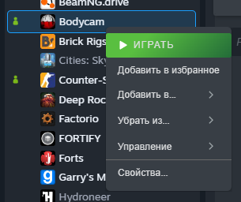
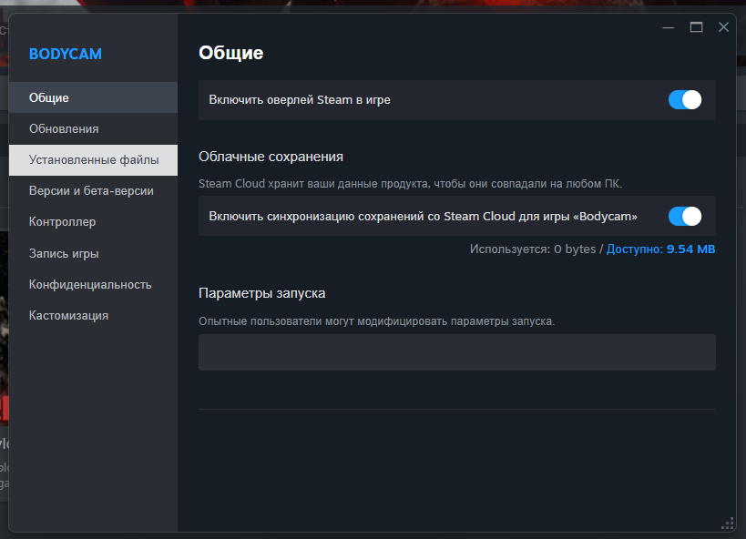
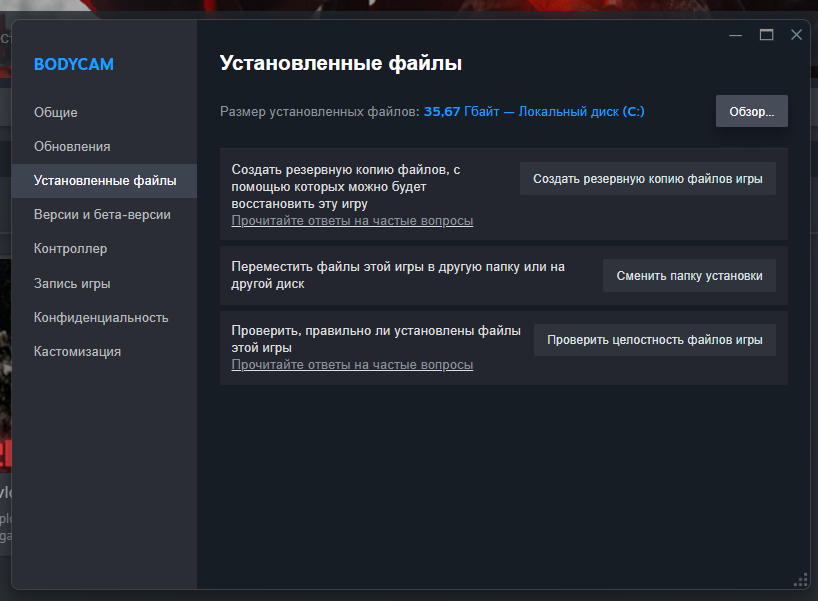
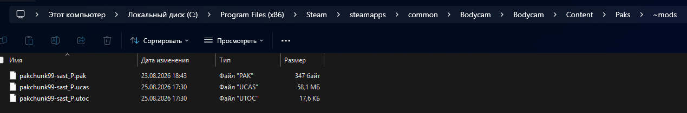

# Кастомные скины для Bodycam

Пак пользовательских скинов для игры **Bodycam** (на данный момент доступно: 2 скина).

---

## 📥 Установка мода

### 1. Скачивание файлов
Скачайте архив с модификацией:
> 📦 **[Скачать архив со скинами (beta)](https://github.com/Pitonex/Bodycam-Custom-Skins/releases/download/beta/mods.zip)**

Распакуйте архив в любое удобное место.

---

### 2. Поиск папки с игрой в Steam
1. Откройте библиотеку **Steam**.
2. Найдите **Bodycam**, нажмите по игре правой кнопкой мыши и выберите **«Свойства...»**  
   

3. В левом меню перейдите во вкладку **«Установленные файлы»**.  
   

4. Нажмите кнопку **«Обзор...»** в правом верхнем углу — откроется корневая папка с игрой.  
   

---

### 3. Перенос файлов мода
1. В открывшейся папке перейдите по пути:
   ```text
   Bodycam ➔ Content ➔ Paks
   ```
2. Перенесите в папку `Paks` распакованную папку со скинами.
3. Убедитесь, что папка называется именно **`~mods`** (с тильдой в начале):
   ```text
   .../Bodycam/Content/Paks/~mods/
   ```

> [!IMPORTANT]
> Внутри папки `~mods` должны лежать файлы модификации с расширениями:
> * `.pak`
> * `.ucas`
> * `.utoc`



---

### 4. Готово!
Запускайте игру и проверяйте новые скины в матче. 🚀

---

## 👕 Где найти скины в игре?

1. Зайдите в главное меню игры.
2. Перейдите по пути:  
   ```text
   SHOP ➔ SEASON ➔ SEASON2
   ```

> [!NOTE]
> Скины находятся **не** в разделе *Locker*! Они добавлены как **отдельные дополнительные скины**, а не заменяют уже существующие в игре.

---

